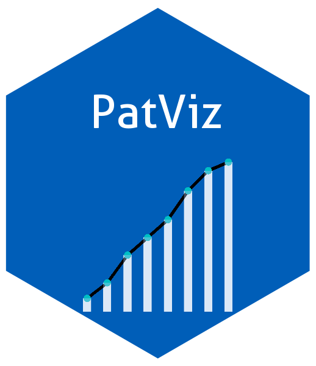

# 📦 PatViz

A lightweight, modular, and fully customizable **Shiny framework** for visualizing patient-level data in clinical trials. This framework is perfect for clinical programmers and data scientists who want full control over UI, domains, and patient-level insights.


------------------------------------------------------------------------

## 🚀 Features

-   🔍 Subject-level patient profile explorer
-   🧱 Modular architecture (e.g., ADSL, ADAE, ADLB domains)
-   📁 Simple, clean folder structure
-   🧪 Built for clinical trial data (ADaM datasets)
-   💡 Designed to be extendable and open source

------------------------------------------------------------------------

## 📦 Installation

``` r
# Install from GitHub (after you upload the repo)
# install.packages("devtools")
devtools::install_github("mumbarkar/PatViz")

# install.packages("pak")
pak::pak("mumbarkar/PatViz")
```

------------------------------------------------------------------------

## Example

This is a basic example which shows you how to solve a common problem:

``` r
library(PatViz)
## basic example code
```

------------------------------------------------------------------------

## 🛠️ Getting Started library(PatViz)

# Load your ADSL dataset (ADaM format)

adsl \<- readRDS("data/adsl.rds") \# or load your own dataset

# Run the patient profile viewer

run_patviz(adsl = adsl)

------------------------------------------------------------------------

## 📂 Project Structure

```{=html}
<pre> <code>
PatViz/
├── R/
│   ├── run_app.R              # Launch function
│   ├── app_ui.R               # UI layout
│   ├── app_server.R           # Server logic
│   ├── patviz_demographics.R     # Example domain module
├── data/                      # Sample datasets
│   └── adsl.rds
├── README.md                  # You're reading this
├── DESCRIPTION                # Package metadata
├── LICENSE                    # (optional) MIT or GPL
</code> </pre>
```

------------------------------------------------------------------------

## 🧱 Adding New Modules To create new domain modules:

Create a file: mod\_<domain>.R (e.g., mod_ae.R)

Add mod\_<domain>*ui(id) and mod*<domain>\_server(id, data_reactive)

Register the module in app_server.R and app_ui.R

------------------------------------------------------------------------

## 📤 Contribution We welcome PRs to add new domain modules, theming, export tools, etc.

Please open an issue or submit a pull request!

------------------------------------------------------------------------

## 📜 License MIT © [Maheshkumar Umbarakar], [2025]

------------------------------------------------------------------------
